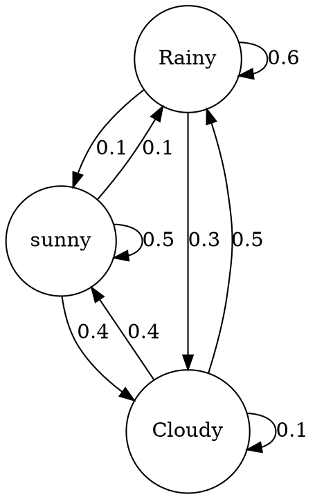

## Preparing graph
https://people.duke.edu/~ccc14/sta-663-2018/notebooks/S10B_MarkovChains.html


### using `dot` 


## command to convert

- In Windows commandline
```shell
dot -Tpng input.dot > input.png
```
