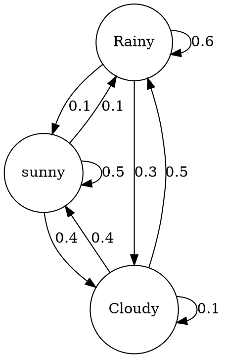

## Preparing graph with **Graphviz**?

Graphviz is open source graph visualization software. Graph visualization is a way of representing structural information as diagrams of abstract graphs and networks. It has important applications in networking, bioinformatics, software engineering, database and web design, machine learning, and in visual interfaces for other technical domains.

It uses `dot` as `graph_description_language`.

[graphviz](https://graphviz.org/)

### using `dot` 


## command to convert

- In Windows commandline
```shell
dot -Tpng input.dot > input.png

dot -Tsvg input.dot

$ echo 'digraph { a -> b }' | dot -Tsvg > output.svg

```

### List of supported output types
   - bmp: Windows Bitmap Format
   - canon: DOT
   - dot: DOT
   - xdot: DOT
   - cmap: Client-side imagemap (deprecated)
   - eps: Encapsulated PostScript
   - fig: FIG
   - gd: GD/GD2 formats
   - gd2: GD/GD2 formats
   - gif: GIF
   - gtk: GTK canvas
   - ico: Icon Image File Format
   - imap: Server-side and client-side imagemaps
   - cmapx: Server-side and client-side imagemaps
   - imap_np: Server-side and client-side imagemaps
   - cmapx_np: Server-side and client-side imagemaps
   - ismap: Server-side imagemap (deprecated)
   - jpg: JPEG
   - jpeg: JPEG
   - jpe: JPEG
   - pdf: Portable Document Format (PDF)
   - plain
   - plain-ext: Simple text format
   - png: Portable Network Graphics format
   - ps: PostScript
   - ps2: PostScript for PDF
   - svg: Scalable Vector Graphics
   - svgz: Scalable Vector Graphics
   - tif: TIFF (Tag Image File Format)
   - tiff: TIFF (Tag Image File Format)
   - vml: Vector Markup Language (VML)
   - vmlz: Vector Markup Language (VML)
   - vrml: VRML
   - wbmp: Wireless BitMap format
   - xlib: Xlib canvas


## References

[Wikipedia DOT graph language](https://en.wikipedia.org/wiki/DOT_(graph_description_language))
[graphviz output](http://www.graphviz.org/doc/info/output.html)
[graphviz commandline](https://graphviz.org/doc/info/command.html)

 

 
